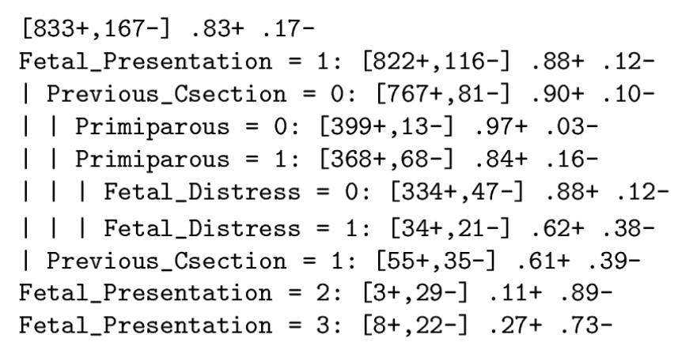
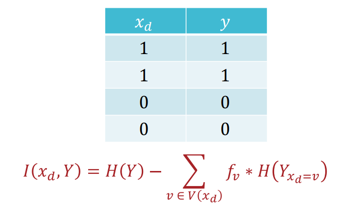
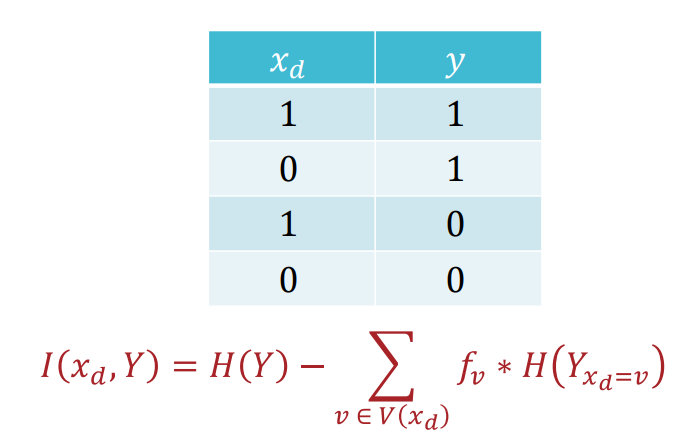

# Decision Tree

1/22/2025

___

### Binary Search Tree

allow searching element in $O(logn)$ work

```python
# iterative approach
def contains_iter(node, key) -> bool:
    curr = node
    while true:
        if key < curr.value & curr.left != null:
            curr = curr.left
        else if key > curr.value & curr.right != null:
            curr = curr.right
        else:
            break # either found it at curr or not exist
	return key == curr.value
```


```python
# recursive approach
def contains_recur(node, key) -> bool:
    if node == null:
        return False
    else if key == node.value:
        return True
    else if key < node.value:
        return contains_recur(node.left, key)
    else:
        return contains_recur(node.right, key)
```


## Decision Tree



#### Questions

- how to decide which feature to split on
- when should we stop splitting


```python
# infer with decision tree
def h(x_prime : features, node) -> label:
    # walk from the root node to a leaf
    # if internal (not a leaf)
    if node.not_leaf():
        # check the corresponding feature
        # go down the corresponding branch
        return h(x_prime, node.decide(x_prime))
	# else (hit a leaf node)
    else:
        # return label
        return node.label
```


### Splitting Criteria

- go get more data :)
- **Mutual Information**


### Mutual Information and Entropy

- **Entropy**
  - how uncertain a result is
  - s how uniform or pure a set is
  - $H(S) = - \sum_{v \in V(S)} \frac{|S_v|}{|S|} log_2\frac{|S_v|}{|S|}$
    - $V(S)$ is the set of all unique values in $S$
    - $S_v = \{e \mid e \in S \cap e = v\}$
  - minimum entropy: all elements are the same $\Rightarrow 0$
  - maximum entropy: even split of binary labels $\Rightarrow 1$

- **Mutual Information**
  $$
  \begin{align*}
  l(y; x) &= H(y) - H(y \mid x_d)\\
  		&= H(y) - \sum_{v \in V(X)} P(X=v)H(Y\mid X=v)
  \end{align*}
  $$

  - maximum mutual information
    - $x$ is 100% correct in predicting $y$
    - $\Rightarrow 1$

  

  - minimum mutual information
    - $x$ does not give any information about $y$
    - $\Rightarrow 0$

  


#### Deciding the ORDER of features?

recurse by mutual information

```python
def train(dataset):
    # initialize a new node
    new_node = Node()
    # any method to find the best splitting attribute
    # e.g. mutual information
    x_d = find_best_attr(dataset)
    
    # split the dataset
    new_node.criteria = x_d
    splits = new_node.split(dataset)
    
    # and make recursive calls
    for subset in splits:
        # TODO decide when to stop 
        	# all label in subset is the same
            # all feature in subset is the same
            # subset empty
            # etc....
        # and assign label to the node(leaf)
        	# by majority vote
            # etc...
        new_node.children.append(train(subset))

    return new_node
```


