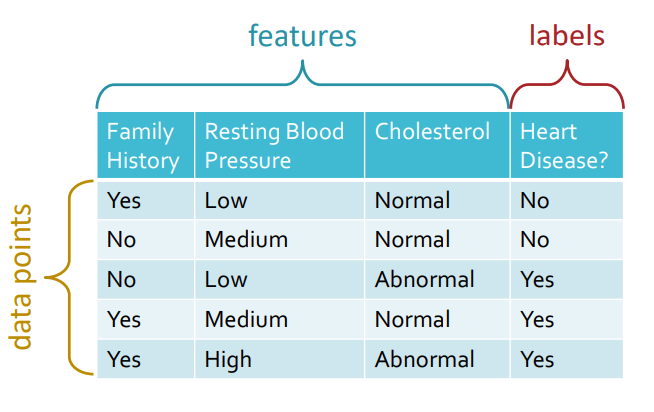
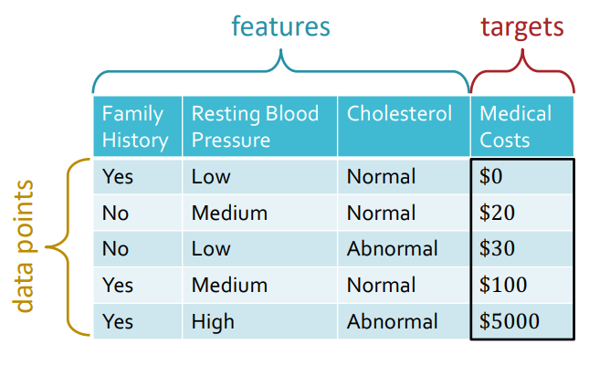

# 1 Course Overview

1/13/2025

___

> ok so it is actually a back-dive into ML. After learning all major parts of a known model, I'm diving back into the underlying math and theory of these blocks. I hope it helps (or I will go 701) 

### Machine Learning

- Task $T$
- Experience $E$
- Performance $P$
  - some measurable
- a program *learns* when its performance $P$ for task $T$, improves given more Experience $E$

### Example - diagnose heart disease

a supervised binary classification task (target is qualitative)

supervised regression task (target is quantitative)

