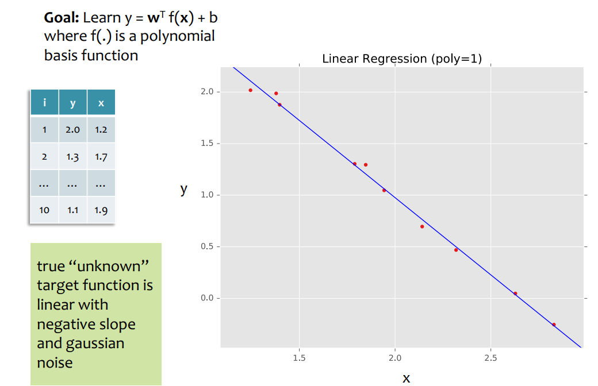
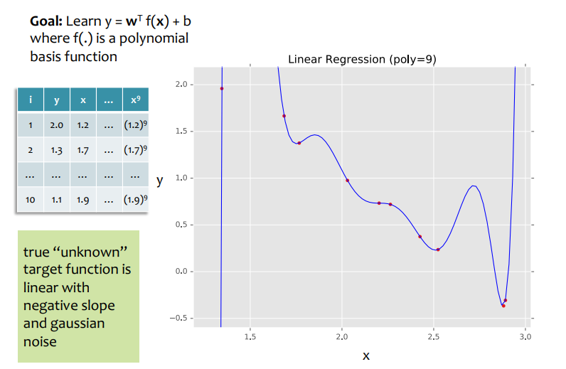
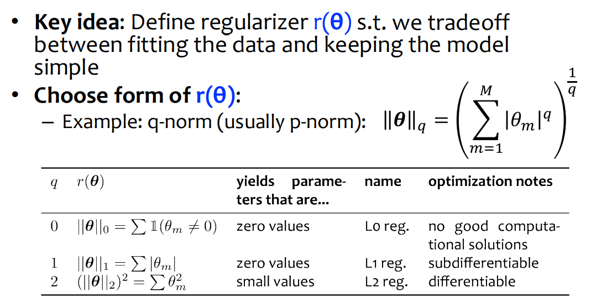
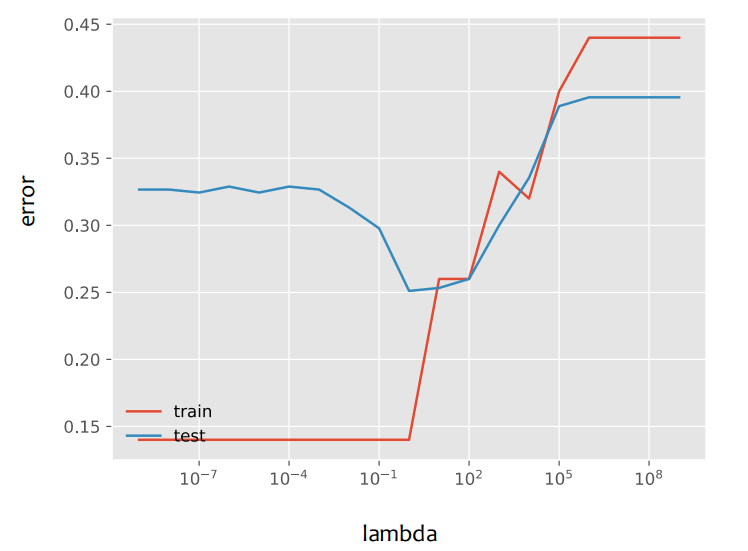

# Feature Engineering

2/12/25 & 2/17/25

___

### Features in NLP

- handcrafted rule-based features
  - larger vector yield better result
  - but reach plateau

- word embedding, bag of word  ...

### Features in CV

- edge detection, corner detection
- convolution

## Non-linear Function

- adding more feature (polynomial features)
  - reduces the training error
  - but test error is bad?
  - **overfitting**

- more data would prevent overfitting

## Regularization

### Occam's Razor

- prefer the simpler hypothesis

- cooperate a new objective function
  - penally large number of parameters

- penalty for complex model - Occam's Razor
- find $\hat{\theta} = \arg\min_\theta J(\theta) + \lambda r(\theta)$
  - where $r (\theta)$ is a regularization function
  - we tradeoff between fitting the data and keeping the model simple

e.g. Linear Regression

- L2 regularization - Ridge Regression
- L1 regularization - LASSO 

#### $\lambda$?

- is a hyperparameter
- control how we want to balance error rate and model complexity

 

### Cautions

- do not regularize the bias term
  - we want to always keep the bias
- it is common to **standardize** the dataset
  - e.g. z-value
