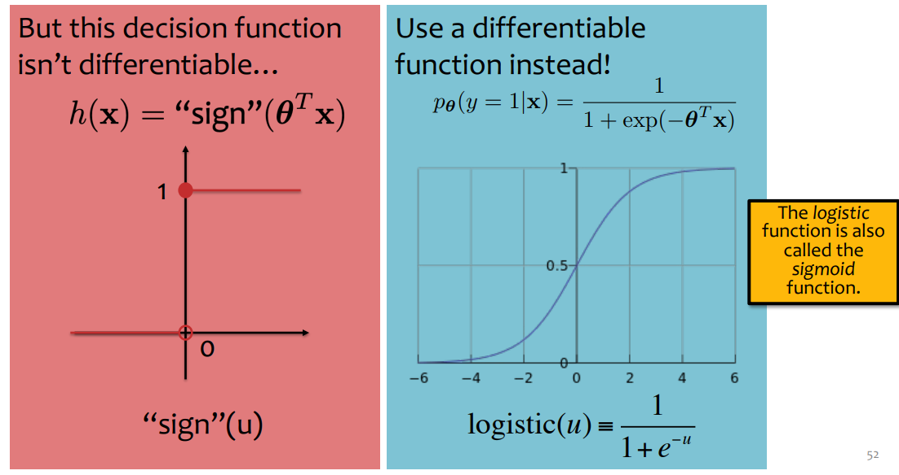
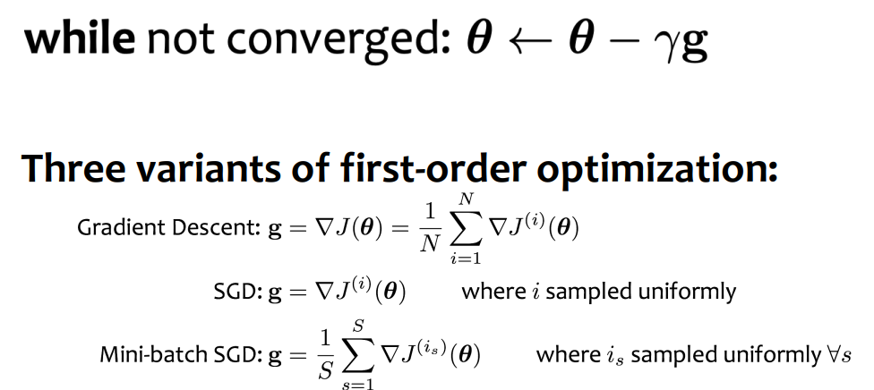

# Logistic Regression

2/10/25  & 2/12/25

___

## Logistic Regression

- it is a classification task but it is called *regression* 
- **sigmoid**

$$
p_\theta(y=1\mid x) = \text{logistic}(\vec{\theta}^T\vec{x}) =  \frac{1}{1+\exp{(-\vec{\theta}^T\vec{x})}}
$$

### Procedure

- **Model setup**
  - $y \sim Bernoulli(\phi)$
  - $\phi = \sigma (\vec{\theta}^T\vec{x})$ where $\sigma$ is the logistic function

$$
p(y \mid \vec{x}, \theta) =
\begin{cases}
\sigma (\vec{\theta}^T\vec{x}), & \text{if } y = 1 \\
1 - \sigma (\vec{\theta}^T\vec{x}), & \text{if } y = 0
\end{cases}
$$

- **Loss function**
  - $J(\theta) = - \frac{1}{N} l(\theta) = \frac{1}{N} \sum_{i=1}^N -\log{p(y^{(i)} \mid \vec{x}^{(i)}, \vec{\theta})}$
  - Optimize by Gradient Descent/SGD
- **Prediction**
  - $\arg\max_{y \in \{0, 1\}} p(y \mid \vec{x})$
  - find the label with the highest probability

### Bayes Optimal Classifier

==screenshot here==

- reducible error
- irreducible error

### Mini-Batch SGD

- instead of the gradient of a single example as in SGD
- approximate true gradient by the average gradient of $k$ randomly chosen examples

