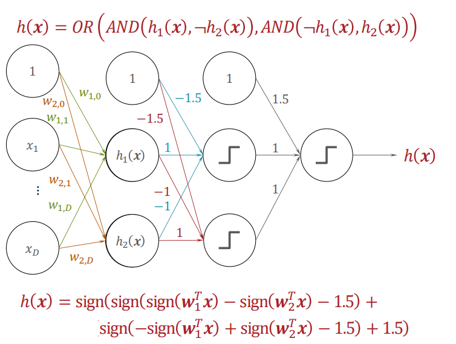
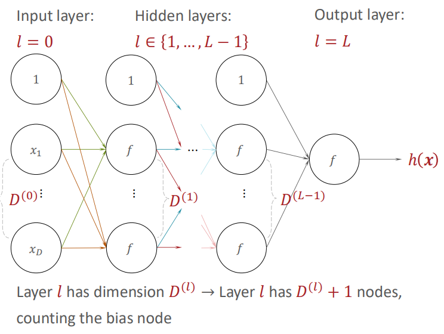

# Neural Networks

2/17/25

___

intuition: combine perceptrons to achieve non-linear decision boundary

modify the Boolean algebra into weights and operations

- $AND(z_1, z_2) = sign(z_1 + z_2 - 1.5)$
- $OR (z_1, z_2) = sign(z_1 + z_2 + 1.5)$
- $NOT(z) = -1 \cdot z$

### Notations

- $D$ dimension
- $L$ Layers
- $w$ weights

