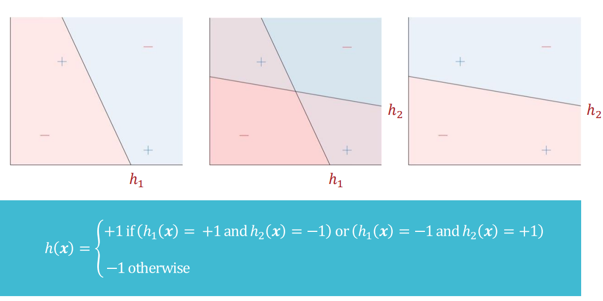
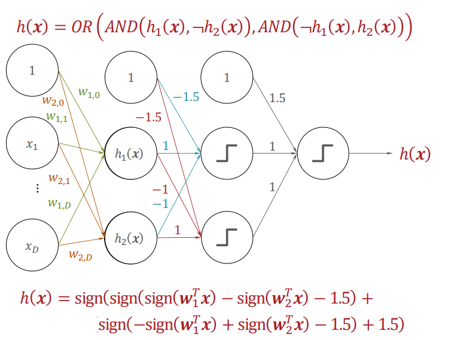
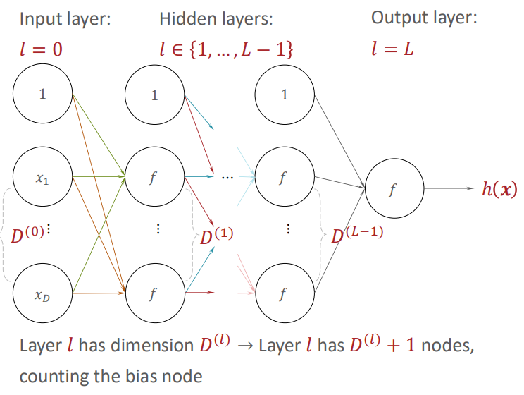
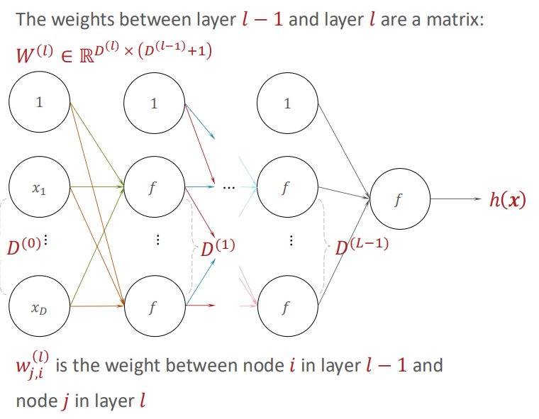
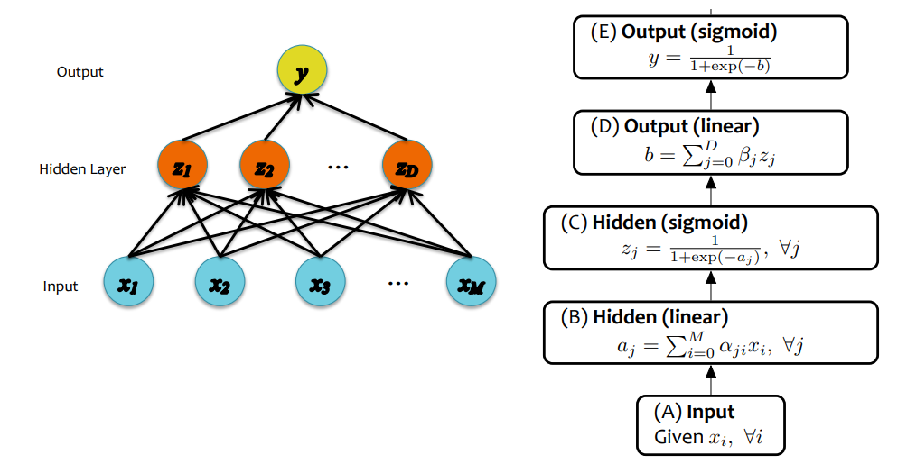

# Neural Networks

2/17/25 & 2/19/25

___

intuition: combine perceptrons to achieve non-linear decision boundary

modify the Boolean algebra into weights and operations

- $AND(z_1, z_2) = sign(z_1 + z_2 - 1.5)$
- $OR (z_1, z_2) = sign(z_1 + z_2 + 1.5)$
- $NOT(z) = -1 \cdot z$

### Notations

- $D$ dimension
- $L$ Layers
- $w$ weights

### Loss Function and Objective Function

notice that output of layer (D) is a real number but the final output after layer (E) is a probability $\in [0, 1]$

#### Quadratic Loss

- same as Linear regression
- MSE

$$
\begin{align*}
J &= l_Q (y, y^{(i)}) = \frac{1}{2} (y - y^{(i)})^2\\
&\frac{dJ}{dy} = y - y^{(i)} 
\end{align*}
$$

#### Binary Cross-Entropy

- same as Binary Logistic Regression
  - negative log likelihood
  - output would be $\in [0, 1]$
- have steeper gradient than quadratic loss

$$
\begin{align*}
J &= l_{CE} (y, y^{(i)}) = -(y^{(i)}\log{y} + (1 - y^{(i)})\log{(1-y)})\\
&\frac{dJ}{dy} = - (y^{(i)} \frac{1}{y} + (1-y^{(i)})\frac{1}{y-1})
\end{align*}
$$

### Multiclass Output

- softmax

$$
y_k = \frac{\exp{b_k}}{\sum_{l=1}^K \exp{b_l}}
$$

> one-hidden layer neural network is a *universal function approximator*
