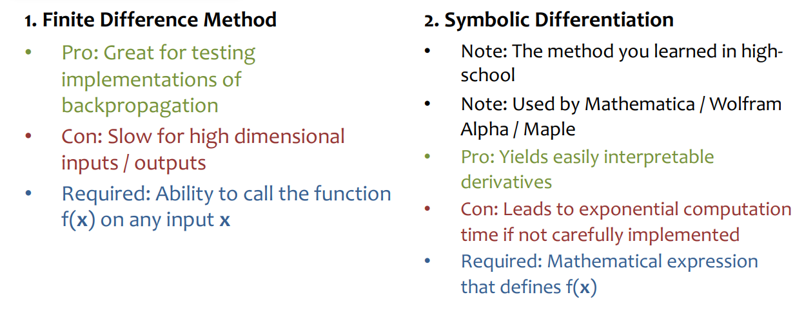
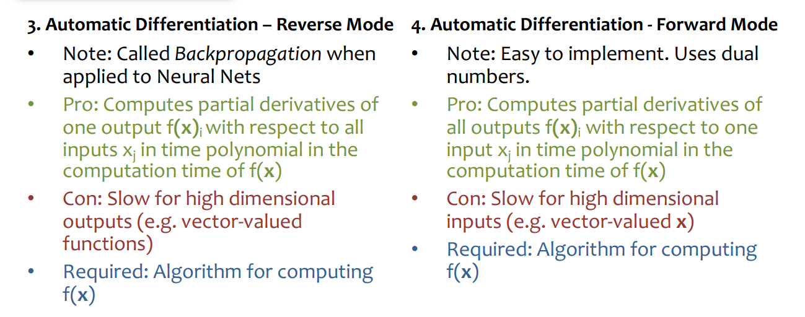
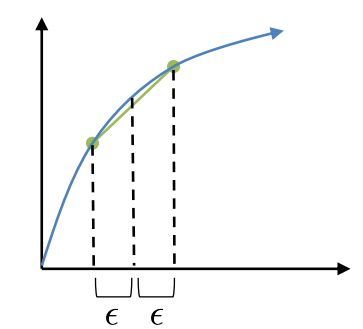

# Backpropagation

2/19/25

___

### Differentiation

- let $f : \mathbb{R}^A \rightarrow \mathbb{R}^B$
- and we want to find $\frac{\delta f(x)_i}{\delta x_j} \forall i, j : A \times B$

#### Finite Difference Method

- find gradient given a small step $\epsilon$

- Suffers from issues of floating point precision, in practice
- Typically only appropriate to use on small examples with an appropriately chosen $\epsilon$

### Backpropagation

- chain rule :)

