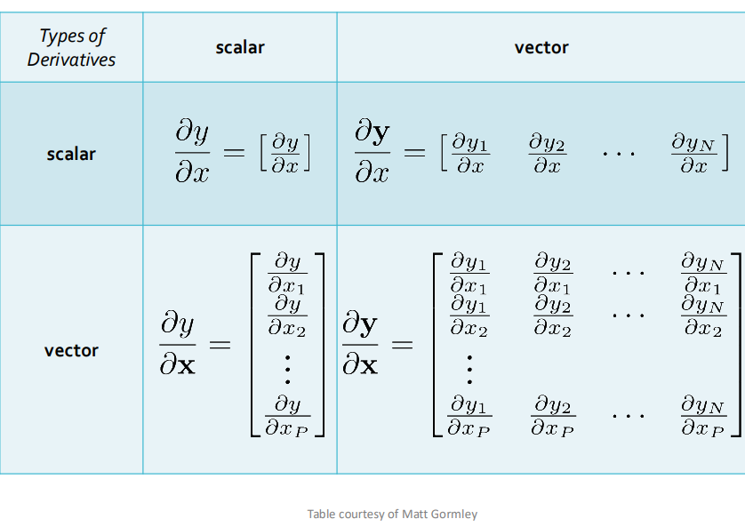
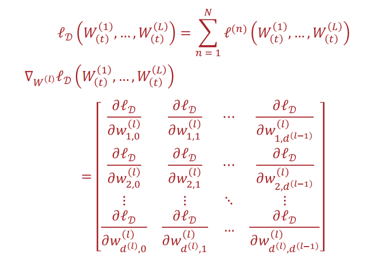
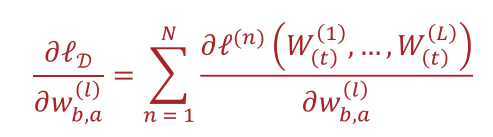

# Backpropagation

2/19/25 & 2/24/25

___

### Differentiation

- let $f : \mathbb{R}^A \rightarrow \mathbb{R}^B$
- and we want to find $\frac{\delta f(x)_i}{\delta x_j} \forall i, j : A \times B$

#### Finite Difference Method

- find gradient given a small step $\epsilon$

- Suffers from issues of floating point precision, in practice
- Typically only appropriate to use on small examples with an appropriately chosen $\epsilon$

### Backpropagation

- chain rule :)
- procedure
  - run a forward path
  - differentiate backwards
    - no repeated computation
    - efficient because a lot of reuse

  - until reach the input
  - descent :)

### Finding Gradient for NN

convention: *denominator layout*

the shape of derivative is aways the same shape as the denominator

 

#### target

find the derivative of all the weights with respect to the result

In general, we need to find

for each $a, b$

