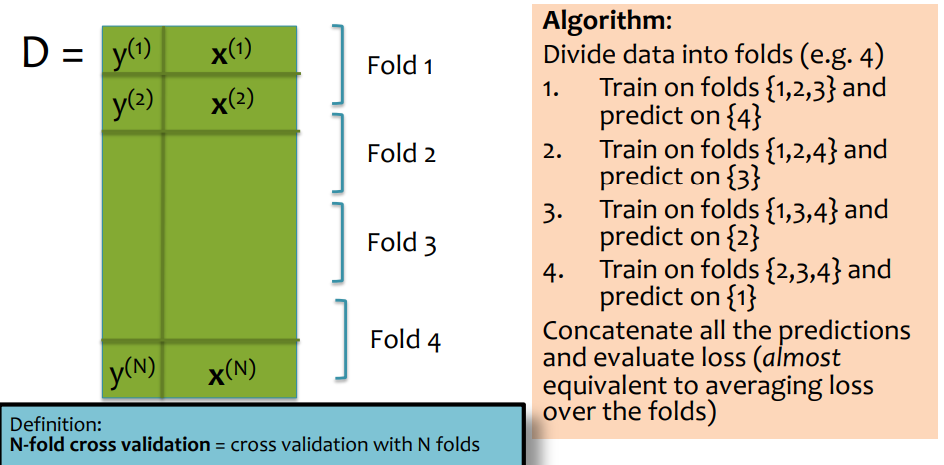

# KNN

1/29/2025

___

### Algorithm

- given a new data point
- find the k nearest points
- do a majority vote with the k points, decide the labels for the new data point

KNN always have zero training error rate ($k=1$) !

​	the nearest point to one point is always itself

#### Theoretical Guarantee

Let $h(x)$ to be a KNN with $k=1$ binary classifier. As the number f training examples $N$ goes to infinity, $\text{error}_\text{true(h)} < 2 \times \text{Bayes Error Rate}$

#### How to handle tie?

- distance weighted voting
- use the nearest one to decide
- increase or decrease $k$ by $1$
- use another distance metric (e.g. Manhattan distance)

#### Inductive Bias of KNN

- similar points should have similar labels
- all dimensions are created equally
- scale may affect the separation! --> *normalization*

## Model Selection

KNN - instance-based, non-parametric

### Hyperparameter

choose the best hyperparameter

e.g. choosing best $k$ for KNN

**cross validation**: use multiple validation set to find the best parameter

### Hyperparameter Optimization

- grid search
- random search
- Bayesian optimization
- graduate-student descent

