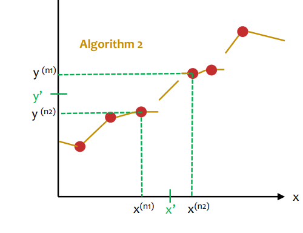
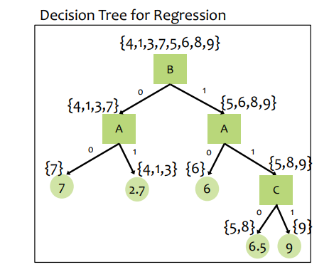
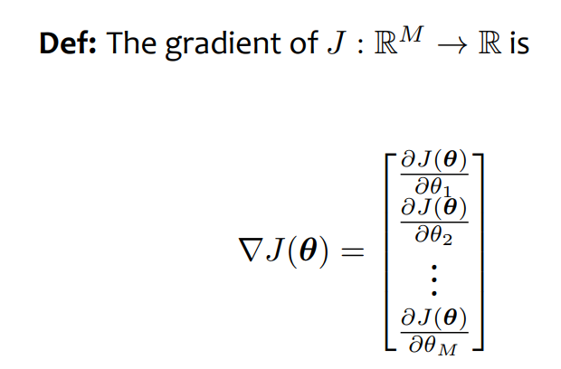

# Linear Regression

2/3/2025

___

## Regression

- **classification** returns a discrete output (label)
- **regression** returns a continuous value as result

### KNN Regression

- train
  - store all $(x, y)$ pairs
- predict
  - pick the k nearest weighted $x$ and return the weighted $y$  

### Decision Tree Regression

- split by a feature

- make prediction by returning the leaf label

  

## Linear Regression

#### Linear Function

$y = w^Tx + b$

- e.g. $y = w_1x_1+w_2x_2 + b$

#### Residual

- the vertical distance from observed $y^{(i)}$ to a predicted value $\hat{y}^{(i)}$
- $e_i = \mid y^{(i)} - (w^T x^{(i)} + b) \mid$

#### Mean Squared Error MSE

- objective function
  $$
  \begin{align*}
  J(\vec{w}, b) &= \frac{1}{N}\sum_{i=1}^Ne_i^2
  \\&=\frac{1}{N}\sum_{i=1}^N(y^{(i)} - (w^T x^{(i)} + b))^2
  \end{align*}
  $$

- 

#### GOAL

minimize the *squared* residual for some training set

### Optimization

- given an objective function $J(\theta)$
- we want to find $\hat{\theta} = \arg\min_{\theta \in \mathbb{R}^M}(\theta)$

#### Random Guessing

- well, what can I say about that

### Gradient Descent!

- choose an initial point $\vec{\theta}$

- repeat until ??

  - compute gradient $\vec{g} = \Delta J(\vec{\theta})$
  - select step size $\delta$
  - update params $\vec{\theta} \leftarrow \vec{\theta} - \delta \vec{g}$

  
