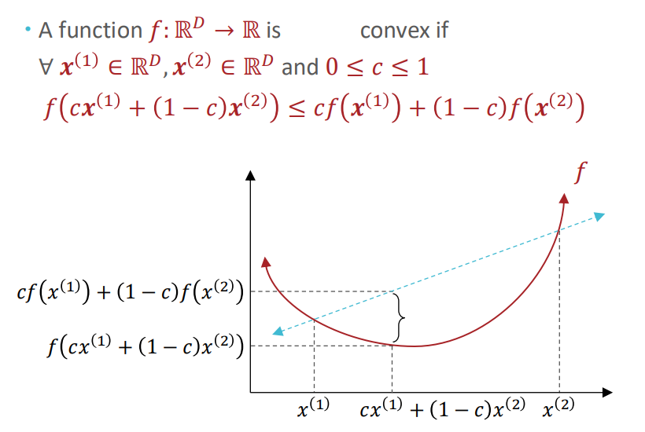
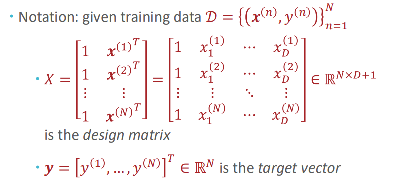

# Optimization

2/5/2025

___

### Convexity

- pick two random points on a function, the line connecting the two points is above the function result in between
- it cuts the function curve when the points are at the bottom
- **strictly convex**: change $\le$ to $<$
- each local minimum is also the global minimum
  - strictly convex function has a unique local/global minimum 

- **non-convex**: have multiple local minimum

## Gradient Descent

- is a *local* optimization algorithm
  - it works well on convex functions

### Closed Form Minimum

idea: set the derivative to 0

$$
\begin{align*}

J(\theta) &= \frac{1}{N} \sum_{i=1}^N \frac{1}{2}(y^{(i)} - \theta^Tx^{(i)})^2)\\
&= \frac{1}{2N} \sum_{i=1}^N (\theta {x^{(i)}}^T - y^{(i)})^2)\\
&= \frac{1}{2N} (\vec{x} \vec{\theta} - \vec{y})^T(\vec{x} \vec{\theta} - \vec{y})\\
&= \frac{1}{2N} (\vec{\theta}^T \vec{x}^T \vec{x} \vec{\theta} - 2\vec{\theta}^T\vec{x}^T\vec{y} + \vec{y}^T\vec{y})\\\\
\Delta J(\vec{\theta}) &= \frac{1}{N} (\vec{x}^T \vec{x} \vec{\theta} - \vec{x}^T\vec{y}) = 0\\
\hat{\theta} &= (X^TX)^{-1}X^T\textbf{y}

\end{align*}
$$

#### Invert of a matrix

- invertible?
  - if the function is not invertible, there are infinite optimal points
    - aka. a flat line bottom
- work $O(D^3)$
  - very expensive

