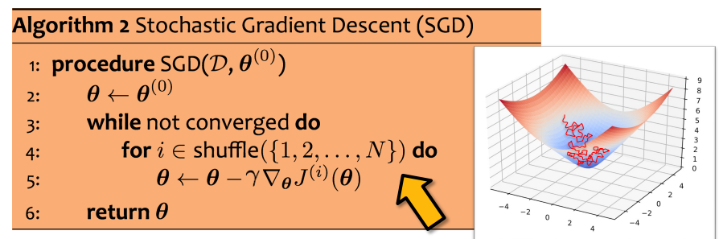
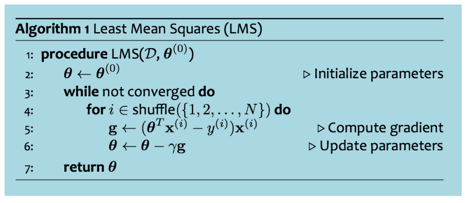
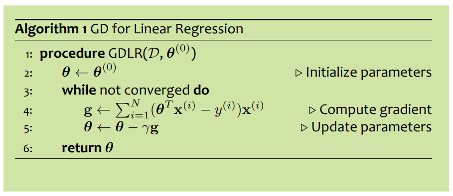

# Stochastic Gradient Descent

2/10/25

___

## Stochastic Gradient Descent

- instead of following the gradient of the objection function
- take a random example point from the training data and take the gradient to that single point
- Imperatively faster?
  - faster computation - only need to compute gradient for one sample
  - rapidly take a step 

-> aka *sample without replacement*

$$
\begin{align*}
\mathbb{E}[\Delta_\theta J(\theta)] 
&= \sum_{i=0}^N P(i) \Delta_\theta J^{(i)}(\theta)\\
&= \sum_{i=0}^N \frac{1}{N} \Delta_\theta J^{(i)}(\theta) \tag{uniform distribution}\\
&= \frac{1}{N} \sum_{i=0}^N \Delta_\theta J^{(i)}(\theta)\\
&= \Delta_\theta J(\theta)\\

\end{align*}
$$

### Gradient Descent for Linear Regression

## Probabilistic Learning

- Likelihood
- MLE

